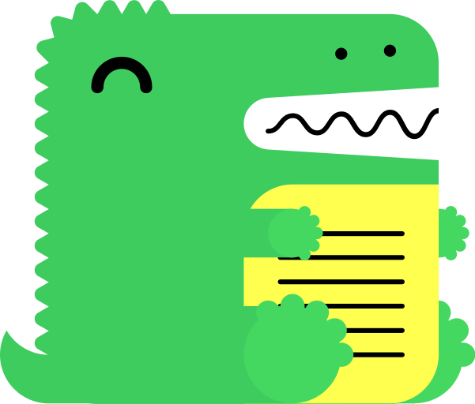
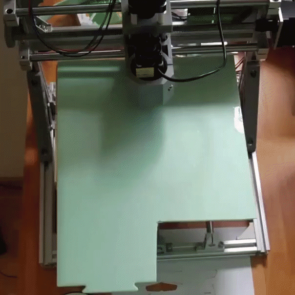

# EF-Informatik

Über mich...

## Filme: Old but Gold
- [Hackers - 1995](https://www.imdb.com/title/tt0113243/)
- [Catch me if you can - 2002](https://www.imdb.com/title/tt0264464/)
- [21 - 2008](https://www.imdb.com/title/tt0478087/)

## Projekte

- [teaching-dev](https://github.com/GBSL-Informatik/teaching-dev) ist aktuell mein ♥️-Projekt.

## Projektlis

### Hexagonale Labyrinth

👉 https://github.com/lebalz/hex_maze

### SQL-Injection Demo

Webseite, um SQL-Injection Angriffe zu üben.

👉 https://github.com/lebalz/sql-injection-demo

### Bastelprojekt

CNC-Laser selber bauen und ansteuern...

## Hobbies
- 🚴‍♂️
- 🚵‍♂️
- ⛷️
- 🧗‍♂️